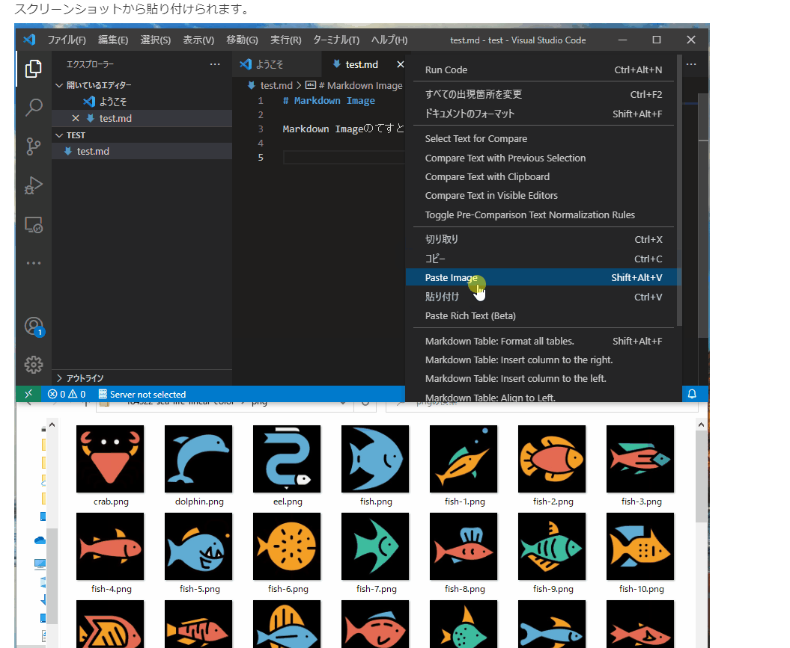
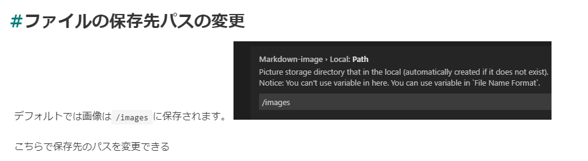

Visual Studio Code Note vscodenote
===

## よく使うショートカット

`F2`

変数の名前を一括変更

`CTRL + SHIFT + E`

フォルダ(ワークスペース)　をアクティブにする
または　ファイル　をアクティブにする
ここらへんは左のアイコンにカーソルを合わせれば書いてある

`F9`

ブレークポイントの設定

`CTRL + PgUp(PgDn)`

ファイルの切り替え

`CTRL + SHIFT + PgUp(PgDn)`

そのファイルを左や右へ移動

`CTRL + K + V`

markdownをプレビューする

`SHIFT + ALT + V`

markdown形式でスクショを貼り付け

[ショートカット一覧](https://skillhub.jp/blogs/234)

[ショートカット一覧](https://dev.classmethod.jp/articles/vscode_file_operation_shortcut_setting/)

 
 
 

## コード入力の時の便利機能

`#%%`

上記でジュピターの機能が使える

 
 
 

## 便利機能

  

`SHIFT + ALT + V`　で貼り付け

上記で保存パスの変更

[markdown貼り付け方法](https://www.suzu6.net/posts/307-vscode-markdown-image/)
